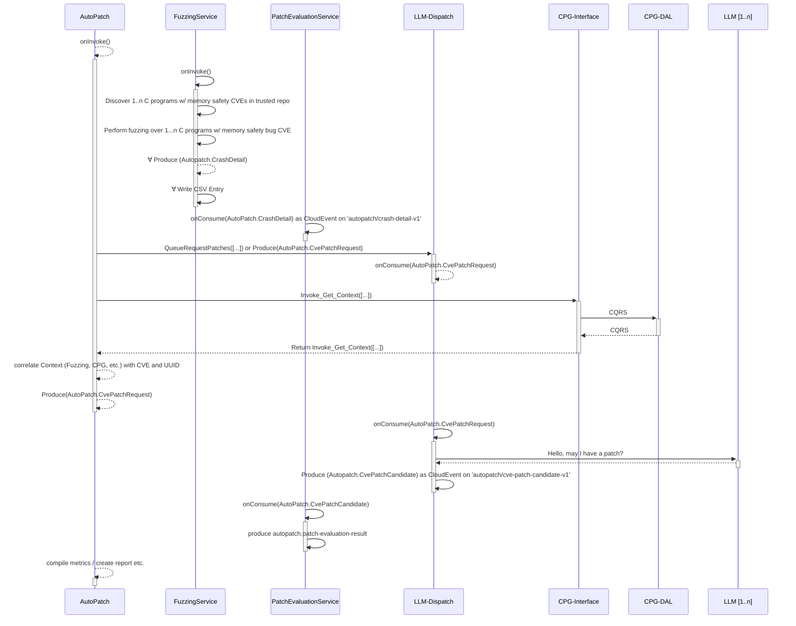

# **AutoPatch: Automated Memory Safety CVE Patching Using a Competitive Ensemble of LLMs with Fuzzing, Address Sanitization, and Code Property Graphs** <!-- omit in toc -->
- [CI Status](#ci-status)
- [Project MetaData](#project-metadata)
- [Introduction](#introduction)
  - [Features](#features)
- [How It Works](#how-it-works)
- [Pre-requisites](#pre-requisites)
- [How to Run](#how-to-run)
- [Versioning Strategy](#versioning-strategy)
- [Logging](#logging)
- [Glossary](#glossary)

High level design sequence diagram:

## CI Status

## Project MetaData

## Introduction  

AutoPatch is a GenAI-assisted tool designed to automatically detect and patch bugs in C code. By combining **Google's Address Sanitizer (ASan)**, **American Fuzzy Lop (AFL)** and **OpenAI's GPT-4o mini**, AutoPatch simplifies the debugging process by identifying and resolving syntactic, runtime and semantic errors in buggy programs.

### Features  

- **Automated Bug Detection:** detects and identifies syntactic errors, runtime crashes and semantic inconsistencies.  
- **Patch Generation:** uses GPT to generate targeted fixes while preserving the program's intended functionality.  
- **Iterative Testing:** retests patched code to ensure bugs are resolved.

## How It Works

1. **Initial Compilation:**  
   The code is compiled with ASan to detect memory-related issues.  
2. **Fuzzing:**  
   AFL tests the program for runtime crashes using mutated inputs.  
3. **Patching with GPT:**  
   Issues detected by ASan and AFL are passed to GPT-4o mini, which generates fixes.  
4. **Iterative Process:**  
   The patched code is retested with AFL to ensure reliability.  

## Pre-requisites

1. Task: <https://taskfile.dev/installation/>

2. If you are running the fuzzing-service in GCE or another cloud provider you may see your fuzzer return an exit code 1 and you may get this message in your debug log:

   - Hmm, your system is configured to send core dump notifications to an
      external utility. This will cause issues: there will be an extended delay
      between stumbling upon a crash and having this information relayed to the
      fuzzer via the standard waitpid() API.
      To avoid having crashes misinterpreted as timeouts, please log in as root
      and temporarily modify /proc/sys/kernel/core_pattern, like so:
      `echo core >/proc/sys/kernel/core_pattern`

   You must log in as root OUTSIDE of a devcontainer and edit the `/proc/sys/kernel/core_pattern` file to read only "core" on the first line before proceeding

## How to Run

1. Clone the repository.  
2. Run the script: `python3 main/main.py`

## Versioning Strategy
This project will use semantic versioning with following rules:

MAJOR version increments when backwards incompatible changes is introduced.
MINOR version increments when backwards compatible feature is introduced INCLUDING support for new datatype versions.
PATCH version increments when a backwards compatible bug fix is introduced.

## Logging

- Uses structured logging via the python stdlib interface which is forward compatible with OTEL.  By default:
  - INFO and ERROR messages use a Console handler capturing stdout and stderr
  - DEBUG messages are logged to files.  The default config works out of the box with the dev container.  Update the file path in a service's `logging-config.json` to `/app/logs/debug.log` if running in a docker compose or kubernetes context

## Glossary

- **Memory Safety Bug**: a vulnerability in which memory is accessed or written in a way that violates the logic (intention) or safety of the program, or performs actions outside of the permitted memory of that program. Common examples include buffer overflow, memory leaks, and use after free. If these vulnerabilities can be exposed by specific input by a user, they can be exploited.
- **Address Sanitizer**: a compilation tool that is capable of improving recognition of memory safety bugs beyond the base compiler. Utilized by a command line argument at compilation time, and can be added as an argument in afl compilation. ASan is the alias commonly used.
- **Bug Log**: the log made at compile time of a program, contains the output (warnings, errors, or ASan messages depending on the compilation context) of the compilation.
- **Fuzzer**: a tool that seeks to find all the control flow areas of a program that takes input (via file or stdin) by mutating the input, and logs any crashes or hangs. For more detailed information on fuzzing, refer to docs/QuickStart.md.
- **LLM**: large language model, such as GPT, LLAMA, or DeepSeek.
