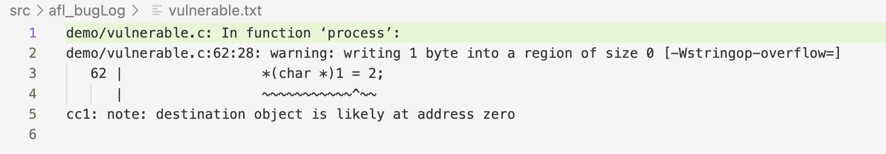
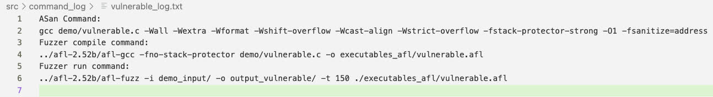

# CS487 Final Project
# AutoPatch: Automated Vulnerable Code Patching with AFL, ASan and GPT

## Introduction  
AutoPatch is a GenAI-assisted tool designed to automatically detect and patch bugs in C code. By combining **Google's Address Sanitizer (ASan)**, **American Fuzzy Lop (AFL)** and **OpenAI's GPT-4o mini**, AutoPatch simplifies the debugging process by identifying and resolving syntactic, runtime and semantic errors in buggy programs.

### Features  
- **Automated Bug Detection:** detects and identifies syntactic errors, runtime crashes and semantic inconsistencies.  
- **Patch Generation:** uses GPT to generate targeted fixes while preserving the program's intended functionality.  
- **Iterative Testing:** retests patched code to ensure bugs are resolved.

## How It Works
1. **Initial Compilation:**  
   The code is compiled with ASan to detect memory-related issues.  
2. **Fuzzing:**  
   AFL tests the program for runtime crashes using mutated inputs.  
3. **Patching with GPT:**  
   Issues detected by ASan and AFL are passed to GPT-4o mini, which generates fixes.  
4. **Iterative Process:**  
   The patched code is retested with AFL to ensure reliability.  

## How to Run
2. Clone the repository.  
3. Run the script:
   ```bash
   python3 main/main.py
   ```

## Logging

- Automatically generates separate log directories and files for the ASan compiler output (asan_bugLog) and AFL compiler output (afl_bugLog).
Example of afl_bugLog/vulnerable.txt:


- Automatically logs commands executed during the running of the service in the command_logs directory. This is very useful for troubleshooting errors in the main service execution.


## Glossary
- **Memory Safety Bug**: a vulnerability in which memory is accessed or written in a way that violates the logic (intention) or safety of the program, or performs actions outside of the permitted memory of that program. Common examples include buffer overflow, memory leaks, and use after free. If these vulnerabilities can be exposed by specific input by a user, they can be exploited.
- **Address Sanitizer**: a compilation tool that is capable of improving recognition of memory safety bugs beyond the base compiler. Utilized by a command line argument at compilation time, and can be added as an argument in afl compilation. ASan is the alias commonly used.  
- **Bug Log**: the log made at compile time of a program, contains the output (warnings, errors, or ASan messages depending on the compilation context) of the compilation. 
- **Fuzzer**: a tool that seeks to find all the control flow areas of a program that takes input (via file or stdin) by mutating the input, and logs any crashes or hangs. For more detailed information on fuzzing, refer to docs/QuickStart.md. 
- **LLM**: large language model, such as GPT, LLAMA, or DeepSeek.

