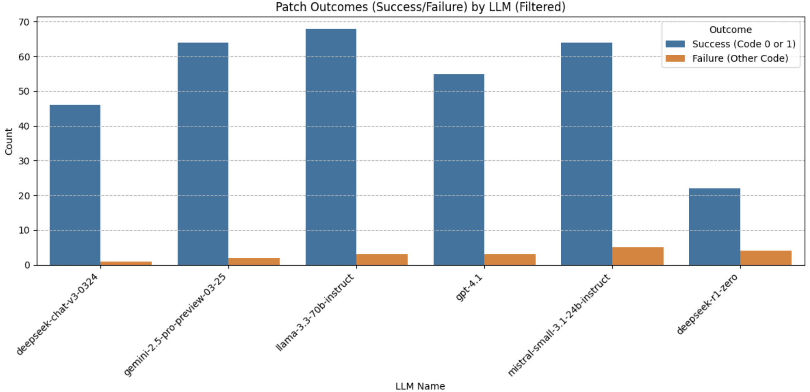

# **AutoPatch: LLM Based Automated Memory Safety Bug (CWE) Patching with Fuzzing, Address Sanitization, and Code Property Graphs** <!-- omit in toc -->

Lead Developer: Robert D. Hernandez <https://www.linkedin.com/in/robhernandez5/>

- [CI Status](#ci-status)
- [Project MetaData](#project-metadata)
- [Introduction](#introduction)
  - [Features](#features)
- [How It Works](#how-it-works)
- [LLM Performance Comparison so far](#llm-performance-comparison-so-far)
- [Pre-requisites](#pre-requisites)
- [How to Run](#how-to-run)
- [Devtools](#devtools)
- [Versioning Strategy](#versioning-strategy)
- [Logging](#logging)
- [Glossary](#glossary)

This project is funded by [Google](https://google.com/) and the [National Science Foundation](https://www.nsf.gov/) through a grant made by the [CAHSI-Google Institutional Research Program](https://cahsi.utep.edu/cahsi-google-irp), in collaboration [Texas A&M University](https://www.tamu.edu/index.html)

   

High level system design diagram:

## CI Status

## Project MetaData

## Introduction  

**AutoPatch**: is an end-to-end GenAI-assisted tool designed to automatically detect and patch bugs in C code by performing vulnerability detection, vulnerability patching, and evaluation of patches for real-world C programs.

By combining **Google's Address Sanitizer (ASan)**, **American Fuzzy Lop (AFL++)** **Code Property Graphs** and we evaluate the feasibility of **various Large Language Models** for additional research towards automatica and sound program repair. AutoPatch targets low level memory safety bugs.  Identifying and resolving memory safety bugs such as Use After Free, Double Free, and Buffer Overflow.

**Method:**

1. **Vulnerability detection** through fuzzing with address sanitizer instrumentation and coverage boosting with code property graphs.
2. **Patching**: sourcing the buggy source code, crash instances, and static analysis to query LLMs to generate a patch.
3. **Evaluation**: sourcing the potential patch (2) and the identified trigger inputs (1) to test the patch’s success.

Theory tells us that creating bug-free programs is nearly impossible and proving correctness in large programs is very difficult and time-consuming.

**AutoPatch** is an attempt to leverage modern tools to get closer to ideal bug-free programs, and do this quicker than previous practices.

### Features  

- **Automated Bug Detection:** detects and identifies runtime crashes and semantic inconsistencies.  
- **Patch Generation:** uses an ensemble of Generative Pretrained Transformers (Large Language Models) to generate targeted fixes while preserving the program's intended functionality.  
- **Iterative Testing:** retests patched code to ensure bugs are resolved.

## How It Works

1. **Initial Compilation:**  
   The code is compiled with ASan to detect memory-related issues.  
2. **Fuzzing:**  
   AFL++ tests the program for runtime crashes using mutated inputs.  
3. **Patching with GenAI:**  
   Issues detected by ASan and AFL++ are passed to a competing ensemble of LLMs, which each generate fixes.  
4. **Iterative Process:**  
   The patched code is retested with crashes conditions generated with AFL++ to ensure reliability.  Potential patches are surfaced to the user for human evaluation.

## LLM Performance Comparison so far

## Pre-requisites

0. docker network "autopatch-llm_autopatch-docker-network"

1. Task: <https://taskfile.dev/installation/>

2. If you are running the fuzzing-service in GCE or another cloud provider you may see your fuzzer return an exit code 1 and you may get this message in your debug log:

   - Hmm, your system is configured to send core dump notifications to an
      external utility. This will cause issues: there will be an extended delay
      between stumbling upon a crash and having this information relayed to the
      fuzzer via the standard waitpid() API.
      To avoid having crashes misinterpreted as timeouts, please log in as root
      and temporarily modify /proc/sys/kernel/core_pattern, like so:
      `echo core >/proc/sys/kernel/core_pattern`

   You must log in as root OUTSIDE of a devcontainer and edit the `/proc/sys/kernel/core_pattern` file to read only "core" on the first line before proceeding

## How to Run

1. Clone the repository.  
2. OUTSIDE the devcontainer
   1. run the script: `docker compose up`
   2. Or assuming you have task installed on your host system: `task run`

## Devtools

## Versioning Strategy

This project will use semantic versioning with following rules:

MAJOR version increments when backward incompatible changes is introduced.
MINOR version increments when backward compatible feature is introduced INCLUDING support for new datatype versions.
PATCH version increments when a backward compatible bugfix is introduced.

## Logging

- Uses structured logging via the python stdlib interface which is forward compatible with OTEL.  By default:
  - INFO and ERROR messages use a Console handler capturing stdout and stderr
  - DEBUG messages are logged to files.  The default config works out of the box with the dev container.  Update the file path in a service's `logging-config.json` to `/app/logs/debug.log` if running in a docker compose or kubernetes context

## Glossary

- **LLM**: large language model, such as GPT, LLAMA, or DeepSeek.
- **Transformer** is a deep learning architecture that was developed by researchers at Google and is based on the multi-head attention mechanism [1](./docs/References/references.bib).
  - Text is converted to numerical representations called tokens, and each token is converted into a vector via lookup from a word embedding table.
  - At each layer, each token is then contextualized within the scope of the context window with other (unmasked) tokens via a parallel multi-head attention mechanism, allowing the signal for key tokens to be amplified and less important tokens to be diminished.
- **`top_p` (nucleus sampling)** is a decoding parameter that selects from the smallest set of tokens whose cumulative probability exceeds *p*. Tokens are then sampled from this subset.
- **`temperature`** controls randomness in token sampling:
  - Higher values (e.g., 1.0) yield more random output. Example: High temperature (e.g., 0.8): Ideal for creative tasks like brainstorming or storytelling, where diversity and imagination are valued.  Encourages the model to explore less likely words, leading to more creative and diverse outputs, but potentially at the cost of coherence.
  - Lower values (e.g., 0.2) make output more deterministic.  Example: Low temperature (e.g., 0.2): Suitable for tasks requiring accuracy and precision, like answering factual questions. Makes the model more likely to select the most probable next word, resulting in predictable and factual outputs.

- **Memory Safety Bug**: a vulnerability in which memory is accessed or written in a way that violates the logic (intention) or safety of the program, or performs actions outside of the permitted memory of that program. Common examples include buffer overflow, memory leaks, and use after free. If these vulnerabilities can be exposed by specific input by a user, they can be exploited.
- **Address Sanitizer**: a compilation tool that is capable of improving recognition of memory safety bugs beyond the base compiler. Utilized by a command line argument at compilation time, and can be added as an argument in afl compilation. ASan is the alias commonly used.
- **Bug Log**: the log made at compile time of a program, contains the output (warnings, errors, or ASan messages depending on the compilation context) of the compilation.
- **Fuzzer**: a tool that seeks to find all the control flow areas of a program that takes input (via file or stdin) by mutating the input, and logs any crashes or hangs. For more detailed information on fuzzing, refer to docs/QuickStart.md.
