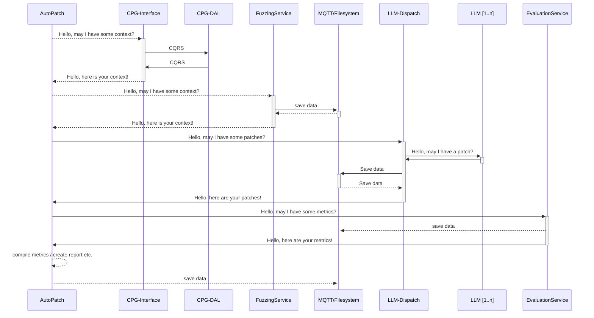

```mermaid
sequenceDiagram
    AutoPatch-->>+CPG-Interface: Hello, may I have some context?
    CPG-Interface->>CPG-DAL: CQRS
    CPG-DAL->>CPG-Interface: CQRS
    CPG-Interface-->>-AutoPatch: Hello, here is your context!
    AutoPatch-->>+FuzzingService: Hello, may I have some context?
    FuzzingService->>+MQTT/Filesystem: save data
    MQTT/Filesystem-->>-FuzzingService: 
    FuzzingService-->>-AutoPatch: Hello, here is your context!
    AutoPatch->>+LLM-Dispatch: Hello, may I have some patches?
    LLM-Dispatch->>+LLM [1..n]: Hello, may I have a patch?
    LLM [1..n] ->>-LLM-Dispatch: 
    LLM-Dispatch->>+MQTT/Filesystem: Save data
    MQTT/Filesystem-->>-LLM-Dispatch: Save data
    LLM-Dispatch->>-AutoPatch: Hello, here are your patches!
    AutoPatch->>+EvaluationService: Hello, may I have some metrics?
    EvaluationService-->>+MQTT/Filesystem: save data
    EvaluationService->>-AutoPatch: Hello, here are your metrics!
    AutoPatch-->>+AutoPatch: compile metrics / create report etc.
    AutoPatch-->>+MQTT/Filesystem: save data
```