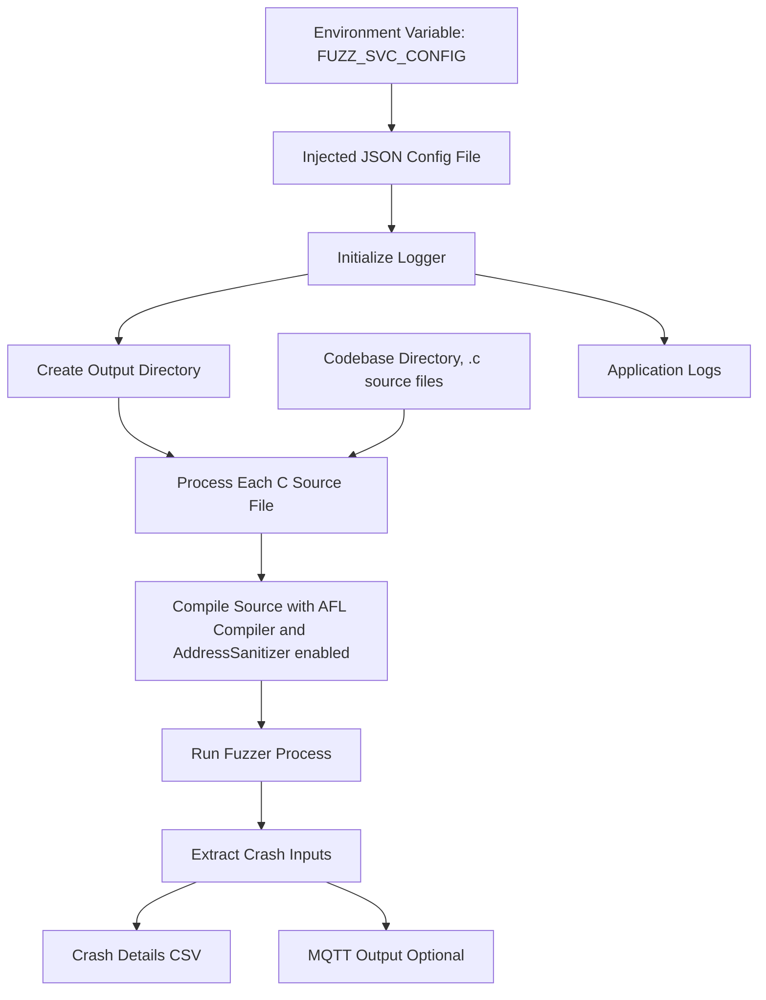

```mermaid
    flowchart TD
        %% Configuration Inputs
        A[Environment Variable: FUZZ_SVC_CONFIG] --> B[Injected JSON Config File]
        
        %% Other Inputs
        C[Codebase Directory, .c source files]

        %% Processing Blocks
        B --> D[Initialize Logger]
        D --> E[Create Output Directory]
        E --> F[Process Each C Source File]
        C --> F
        F --> G[Compile Source with AFL Compiler and AddressSanitizer enabled]
        G --> H[Run Fuzzer Process]
        H --> I[Extract Crash Inputs]

        %% Outputs
        I --> J[Crash Details CSV]
        D --> K[Application Logs]
        I --> L[MQTT Output Optional]
```