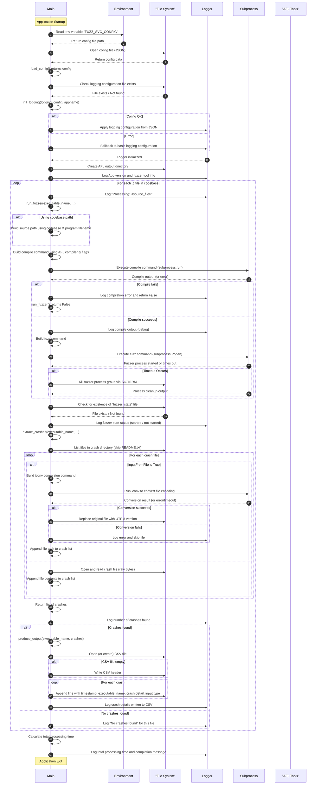

```mermaid
    sequenceDiagram
        autonumber
        participant M as Main
        participant E as Environment
        participant FS as "File System"
        participant L as Logger
        participant SP as Subprocess
        participant AFL as "AFL Tools"

        Note over M: Application Startup

        %% Load configuration
        M->>E: Read env variable "FUZZ_SVC_CONFIG"
        E-->>M: Return config file path
        M->>FS: Open config file (JSON)
        FS-->>M: Return config data
        M->>M: load_config() returns config

        %% Initialize logging
        M->>FS: Check logging configuration file exists
        FS-->>M: File exists / Not found
        M->>M: init_logging(logging_config, appname)
        alt Config OK
            M->>L: Apply logging configuration from JSON
        else Error
            M->>L: Fallback to basic logging configuration
        end
        L-->>M: Logger initialized

        %% Prepare application environment
        M->>FS: Create AFL output directory
        M->>L: Log App version and fuzzer tool info

        %% Process each C source file in the input codebase
        loop For each .c file in codebase
            M->>L: Log "Processing: <source_file>"

            %% Run Fuzzer
            M->>M: run_fuzzer(executable_name, ...)
            alt Using codebase path
                M->>M: Build source path using codebase & program filename
            end
            M->>M: Build compile command using AFL compiler & flags
            M->>SP: Execute compile command (subprocess.run)
            SP-->>M: Compile output (or error)
            alt Compile fails
                M->>L: Log compilation error and return False
                M-->>M: run_fuzzer() returns False
            else Compile succeeds
                M->>L: Log compile output (debug)
                M->>M: Build fuzz command
                M->>SP: Execute fuzz command (subprocess.Popen)
                SP-->>M: Fuzzer process started or times out
                alt Timeout Occurs
                    M->>FS: Kill fuzzer process group via SIGTERM
                    SP-->>M: Process cleanup output
                end
            end
            M->>FS: Check for existence of "fuzzer_stats" file
            FS-->>M: File exists / Not found
            M->>L: Log fuzzer start status (started / not started)

            %% Extract Crashes
            M->>M: extract_crashes(executable_name, ...)
            M->>FS: List files in crash directory (skip README.txt)
            loop For each crash file
                alt inputFromFile is True
                    M->>M: Build iconv conversion command
                    M->>SP: Run iconv to convert file encoding
                    SP-->>M: Conversion result (or error/timeout)
                    alt Conversion succeeds
                        M->>FS: Replace original file with UTF-8 version
                    else Conversion fails
                        M->>L: Log error and skip file
                    end
                    M->>M: Append file path to crash list
                else
                    M->>FS: Open and read crash file (raw bytes)
                    M->>M: Append file contents to crash list
                end
            end
            M-->>M: Return list of crashes
            M->>L: Log number of crashes found

            %% Process Crash Outputs
            alt Crashes found
                M->>M: produce_output(executable_name, crashes)
                M->>FS: Open (or create) CSV file
                alt CSV file empty
                    M->>FS: Write CSV header
                end
                loop For each crash
                    M->>FS: Append line with timestamp, executable_name, crash detail, input type
                end
                M->>L: Log crash details written to CSV
            else No crashes found
                M->>L: Log "No crashes found" for this file
            end
        end

        %% Finish Processing
        M->>M: Calculate total processing time
        M->>L: Log total processing time and completion message

        Note over M: Application Exit
```