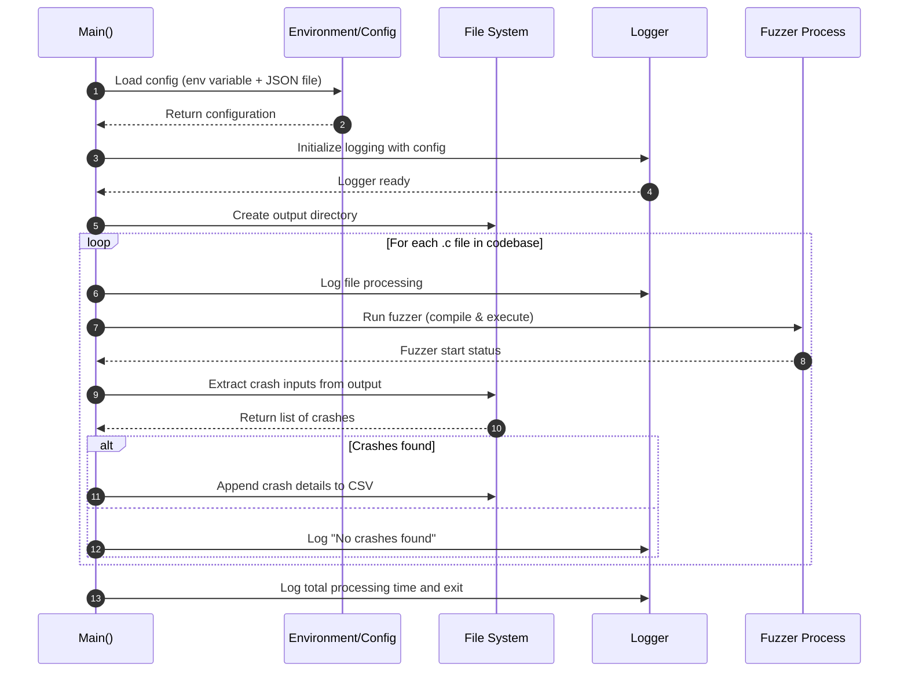

```mermaid
    sequenceDiagram
        autonumber
        participant Main as Main()
        participant Env as Environment/Config
        participant FS as File System
        participant Logger as Logger
        participant Fuzzer as Fuzzer Process

        %% Application startup
        Main->>Env: Load config (env variable + JSON file)
        Env-->>Main: Return configuration
        Main->>Logger: Initialize logging with config
        Logger-->>Main: Logger ready

        Main->>FS: Create output directory

        %% Process each C source file
        loop For each .c file in codebase
            Main->>Logger: Log file processing
            Main->>Fuzzer: Run fuzzer (compile & execute)
            Fuzzer-->>Main: Fuzzer start status

            Main->>FS: Extract crash inputs from output
            FS-->>Main: Return list of crashes

            alt Crashes found
                Main->>FS: Append crash details to CSV
            else
                Main->>Logger: Log "No crashes found"
            end
        end

        %% Finish processing
        Main->>Logger: Log total processing time and exit
```