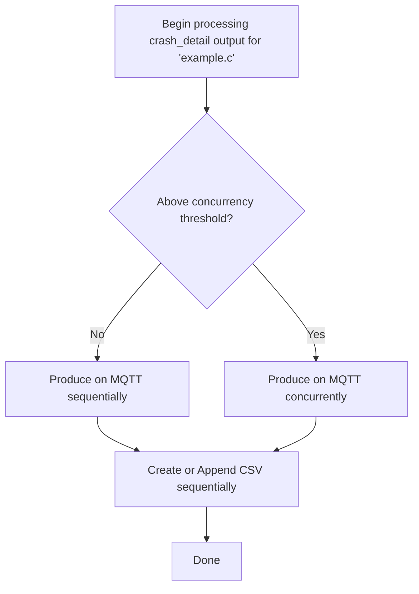

# MQTT Concurrency Diagram as Flowchart <!-- omit in toc -->

[The same diagram as the below mermaid diagram, as a editable bitmap file](mqtt-concurrncy.drawio.png)

```mermaid
graph TD;
    A[Begin processing crash_detail output for 'example.c'] --> B{Above concurrency threshold?}
    B -- No --> C[Produce on MQTT sequentially]
    B -- Yes --> D[Produce on MQTT concurrently]
    C --> E[Create or Append CSV sequentially]
    D --> E
    E --> F[Done]
```
