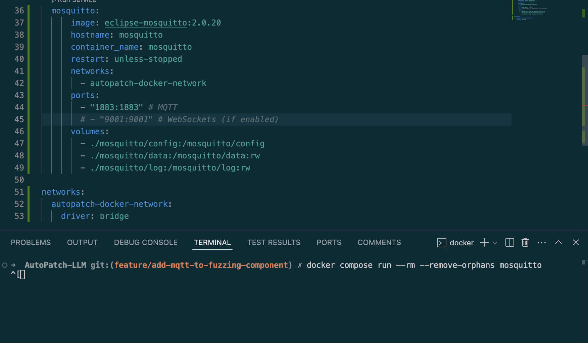
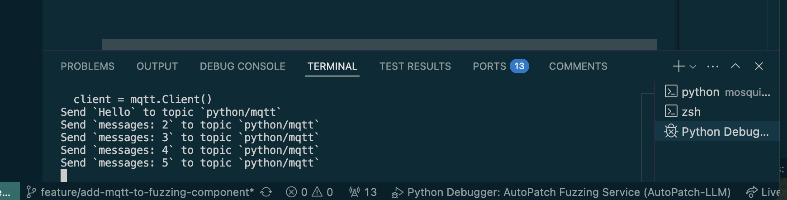
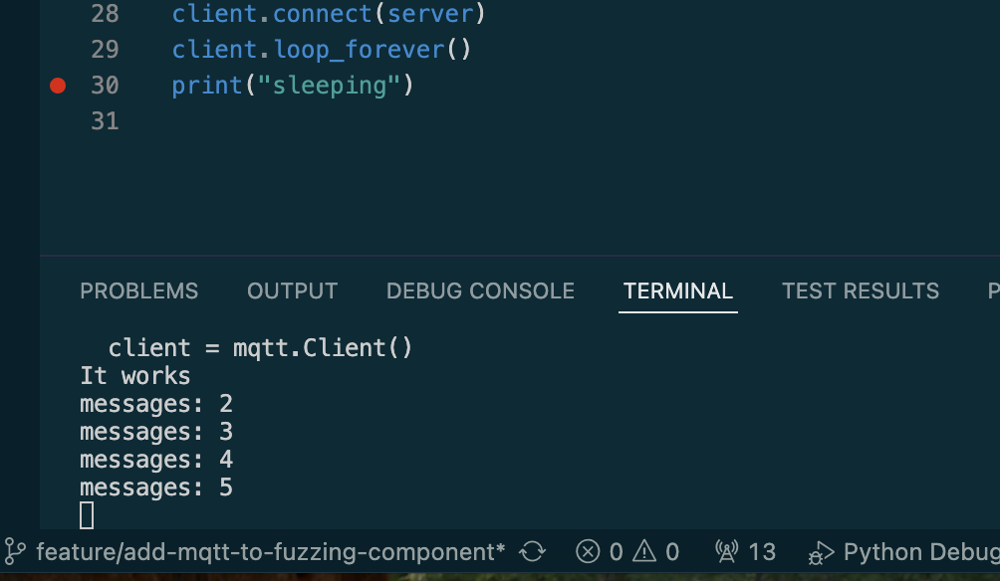

# MQTT Technical Spike <!-- omit in toc -->
- [Spike: MQTT Technical Spike](#spike-mqtt-technical-spike)
- [Goal](#goal)
- [Method](#method)
- [Evidence](#evidence)
  - [Code samples](#code-samples)
- [Conclusions](#conclusions)
- [Next Steps](#next-steps)
- [References](#references)

## Spike: MQTT Technical Spike
Conducted by: Robert D. Hernandez rherna70@uic.edu
Backlog Work Item: [Github Issue #31]{https://github.com/sysec-uic/AutoPatch-LLM/issues/31}

## Goal

We need our processes to communicate with each other, and we are not building an internet accessible API.  Answer: What is the minium required code to run the simple pub-sub message broker MQTT in it's own container process and communicate with it with two simple python processes?

## Method
This technical spike will build prototype to test MQTT in an isolated environment, and will leverage esearch existing documents and samples.

## Evidence

> [!IMPORTANT]  
> Network as Code: Processes communicating with each other between containers using the network will need to have one defined and configured for each container.

For example in the devcontainer 
devcontainer json
```json
	"runArgs": [
		"--network", "autopatch-llm_autopatch-docker-network",
		"--env-file", ".devcontainer/devcontainer.env"
	],
```

and a definition for network at the contianer orchestrator level 

```yaml
# docker-compose.yml
networks:
    autopatch-docker-network:
    driver: bridge
```

Document the evidence collected that informed the conclusions below. Examples may include:

Metrics
- Sent a handful (5) messages over the broker
- image: eclipse-mosquitto:2.0.20

Documentation that indicates the solution can provided the desired capabilities

Image showing a simple example docker compose service running eclipse mosquitto 

A simple MQTT publisher running in a python debugger 

A simple MQTT consumer running on the CLI

### Code samples

Simple mosquitto.conf to be placed at `/mosquitto/config/mosquitto.conf` inside the running broker container.  The `1883` port is the default configuration.  

> [!CAUTION]
> Advises about risks or negative outcomes of certain actions.
Caution `allow_anonymous` here allows for insecure connections.  **Do not use in deployed environments.**

```json
listener 1883
allow_anonymous true
persistence true
persistence_location /mosquitto/data/
log_dest file /mosquitto/log/mosquitto.log
```
REF: https://mosquitto.org/man/mosquitto-conf-5.html

```python
# mqtt-consume.py
import time
import paho.mqtt.client as mqtt


def on_connect(client, userdata, flags, rc):
    topic = "python/mqtt"
    client.subscribe(topic)


def on_message(client, userdata, msg):
    if msg.payload.decode("utf-8") == "Hello":
        client.publish("test", "HI")
        print("It works")
    else:
        print(msg.payload.decode("utf-8"))


server = "mosquitto"
client = mqtt.Client()
client.on_message = on_message
client.on_connect = on_connect
client.connect(server)
client.loop_forever()
print("sleeping")

```

```python
# mqtt-publish.py
import time

import paho.mqtt.client as mqtt

broker = "mosquitto"
port = 1883
topic = "python/mqtt"
fuzzing_service_mqtt_publish_topic = "autopatch/crash_detail-v0.1.0"

client = mqtt.Client()
client.connect(broker, port)

msg = "Hello"
msg_count = 1
while True:
    if msg_count > 1:
        msg = f"messages: {msg_count}"
    # at least once delivery
    client.publish(topic, msg, qos=1)
    print(f"Send `{msg}` to topic `{topic}`")
    msg_count += 1
    time.sleep(1)
    if msg_count > 5:
        break


## callback function for on_publish
def on_publish(client, userdata, mid):
    print(f"Message {mid} published")


client.on_publish = on_publish
print("sleep")
```

## Conclusions
What was the answer to the question(s) outlined at the start of the spike? Capture what was learned that will inform future work.

## Next Steps

Use of a pub/sub process for machine-to-machine communication will be intergrated into the fuzzing component with engineering for reuse into the llm-dispatch and patch evaluation and/or other components.  Ideally a facade will be designed and provide for easy the replacement of MQTT with another pub/sub solution like Google Cloud Pub/Sub.

There was no work blocked or dependent on the learning within this spike.

## References
- https://www.emqx.com/en/blog/how-to-use-mqtt-in-python
- https://hub.docker.com/_/eclipse-mosquitto
- https://eclipse.dev/paho/files/paho.mqtt.python/html/client.html
- https://github.com/eclipse-paho/paho.mqtt.python?tab=readme-ov-file#getting-started
- https://github.com/eclipse-mosquitto/mosquitto
- https://cloud.google.com/pubsub#documentation
