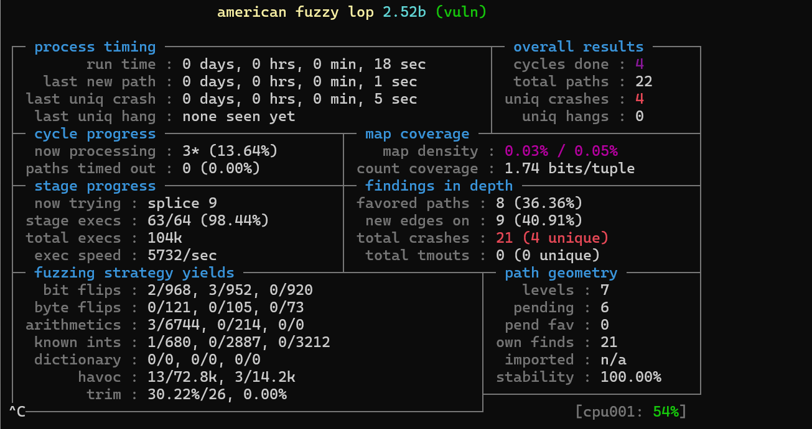

# Template: Technical Spike <!-- omit in toc -->
- [Spike: Upgrading to AFL++](#spike-afl++-technical-spike)
- [Goal](#goal)
- [Method](#method)
- [Evidence](#evidence)
- [Conclusions](#conclusions)
- [Next Steps](#next-steps)

## Spike: Transitioning from Afl2.52b to Afl++ Technical Spike
Conducted by: Arushi Pandey apande29@uic.edu   
Backlog Work Item: [Github Issue #25]{https://github.com/sysec-uic/AutoPatch-LLM/issues/25}

## Goal

Since AFL 2.52b has been archived, this spike investigates the transition to AFL++ for the fuzzing component. The goal is to determine how seamless the transition is when running a basic fuzzing example and identify any changes required in the compilation, or execution.


## Method
To evaluate the transition from AFL 2.52b to AFL++, this spike leverages the AFL Training repository (mykter/afl-training). We will specifically use the quickstart exmaple for this spike. 

## Evidence
> [!IMPORTANT]  
> The original AFL repository (https://github.com/google/AFL) has been archived, so we cannot clone it to install AFL 2.52b directly.


### 1) Installing AFL2.52b and AFL++

#### For installing AFL2.52b:
We are using the afl-2.52b folder inside the bin folder as we cannot download it from the original repo.

#### For installing AFL++: 
```sh
$ git clone https://github.com/AFLplusplus/AFLplusplus
$ cd AFLplusplus
```
```sh
$ make distrib
$ sudo make install
```

Test to see if the installation was successful:
```sh
$ afl-fuzz --version
```

Since we have installed afl++ 4.22a version, this is the output: 


Key Finding: Running 'sudo apt install afl' installs AFL++, not AFL 2.52b.


As shown above, the afl package available on ubuntu just installs afl++ version 4.00c.

### 2) Sample Program

We are using the quickstart example from AFL Training repository (mykter/afl-training). We are naming this vulnerable code as vuln.c: 

```sh
#include <string.h>
#include <stdio.h>
#include <unistd.h>
#include <stdlib.h>

#define INPUTSIZE 100

int process(char *input)
{
	char *out;
	char *rest;
	int len;
	if (strncmp(input, "u ", 2) == 0)
	{ // upper case command
		char *rest;
		len = strtol(input + 2, &rest, 10); // how many characters of the string to upper-case
		rest += 1;							// skip the first char (should be a space)
		out = malloc(len + strlen(input));	// could be shorter, but play it safe
		if (len > (int)strlen(input))
		{
			printf("Specified length %d was larger than the input!\n", len);
			return 1;
		}
		else if (out == NULL)
		{
			printf("Failed to allocate memory\n");
			return 1;
		}
		for (int i = 0; i != len; i++)
		{
			char c = rest[i];
			if (c > 96 && c < 123) // ascii a-z
			{
				c -= 32;
			}
			out[i] = c;
		}
		out[len] = 0;
		strcat(out, rest + len); // append the remaining text
		printf("%s", out);
		free(out);
	}
	else if (strncmp(input, "head ", 5) == 0)
	{ // head command
		if (strlen(input) > 6)
		{
			len = strtol(input + 4, &rest, 10);
			rest += 1;		  // skip the first char (should be a space)
			rest[len] = '\0'; // truncate string at specified offset
			printf("%s\n", rest);
		}
		else
		{
			fprintf(stderr, "head input was too small\n");
		}
	}
	else if (strcmp(input, "surprise!\n") == 0)
	{
		// easter egg!
		*(char *)1 = 2;
	}
	else
	{
		return 1;
	}
	return 0;
}

int main(int argc, char *argv[])
{
	char *usage = "Usage: %s\n"
				  "Text utility - accepts commands and data on stdin and prints results to stdout.\n"
				  "\tInput             | Output\n"
				  "\t------------------+-----------------------\n"
				  "\tu <N> <string>    | Uppercased version of the first <N> bytes of <string>.\n"
				  "\thead <N> <string> | The first <N> bytes of <string>.\n";
	char input[INPUTSIZE] = {0};

	// Slurp input
	if (read(STDIN_FILENO, input, INPUTSIZE) < 0)
	{
		fprintf(stderr, "Couldn't read stdin.\n");
	}

	int ret = process(input);
	if (ret)
	{
		fprintf(stderr, usage, argv[0]);
	};
	return ret;
}
```
### 3) Testing the AFL 2.52b fuzzer

#### a) Creating the executable:

```sh
$ /path/to/folder/afl-2.52b/afl-gcc -o vuln vuln.c
```
This creates the executable and stores is as 'vuln'.


#### b) Creating the input and output folder:

```sh
$ mkdir input output
$ echo "my seed" > input/seed.txt
```
These are the files at this point: 


#### c) Running the fuzzer
```sh
$ /path/to/folder/afl-2.52b/afl-fuzz -i input -o output -- ./vuln
```

Fuzzer runs:



### 4) Testing the AFL++ fuzzer


#### a) Creating the executable:
```sh
$ afl-clang-fast -o vuln vuln.c
```


This creates the executable and stores it as vuln

#### b) Creating the input and output folders:

```sh
$ mkdir input output
$ echo "my seed" > input/seed.txt
```
These are the files at this point:


#### c) Running the fuzzer;
```sh
$ afl-fuzz -i input -o output ./vuln
```

Fuzzer runs:


## Conclusions

We have successfully analyzed the transition from AFL 2.52b to AFL++ and confirmed that the migration is seamless with minimal changes required, most of which are at the time of the execution. 

## Next Steps

We now have to update our existing fuzzing setup to use AFL++ as the primary fuzzer instead of AFL 2.52b. This includes modifying compilation scripts, execution workflows, and any integration points to ensure a smooth transition.  
