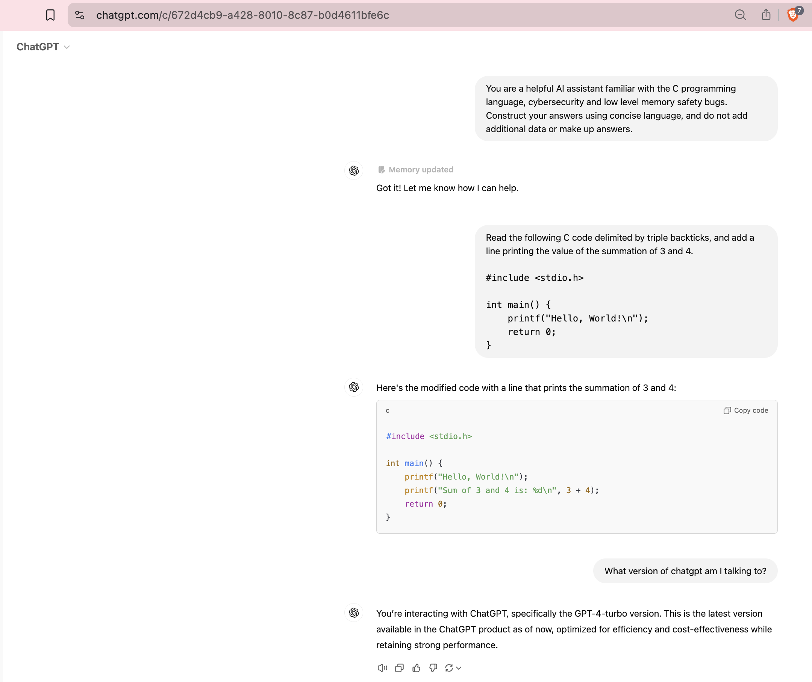

- [Input](#input)
- [Results](#results)
  - [ChatGPT vGPT-4-turbo](#chatgpt-vgpt-4-turbo)
- [Metrics](#metrics)
  - [Accuracy](#accuracy)
    - [Bug Detection Rate](#bug-detection-rate)
    - [False Positives](#false-positives)
  - [Solution Quality](#solution-quality)
    - [Correctness of Fixes](#correctness-of-fixes)
    - [Improvement in Code Safety](#improvement-in-code-safety)
  - [Execution Performance](#execution-performance)
    - [Latency](#latency)
    - [Resource Utilization](#resource-utilization)
  - [Comprehensibility](#comprehensibility)
    - [Clarity of Fixes](#clarity-of-fixes)
    - [Explanatory Quality](#explanatory-quality)

# Input 

(Here provide both a path for, and a verbatim in-line copy of the system and user prompt used)

Input System Prompt: `assets/system_prompt_example_0.txt`

"You are a helpful AI assistant familiar with the C programming language, cybersecurity and low level memory safety bugs.  Construct your answers using concise language, and do not add additional data or make up answers."


Input User Prompt: `assets/user_prompt_example_0.txt`

"Read the following C code delimited by triple backticks, and add a line printing the value of the summation of 3 and 4.

```
#include <stdio.h>

int main() {
    printf("Hello, World!\n");
    return 0;
}
```
"

# Results 

## ChatGPT vGPT-4-turbo

Here's the modified code with a line that prints the summation of 3 and 4:

```c
#include <stdio.h>

int main() {
    printf("Hello, World!\n");
    printf("Sum of 3 and 4 is: %d\n", 3 + 4);
    return 0;
}
```


# Metrics
(REFER TO PROJECT PROPOSAL DOCS FOR MOST RECENT RELEVANT METRICS)

## Accuracy
### Bug Detection Rate
some text here
### False Positives
some text here

## Solution Quality
### Correctness of Fixes
some text here
### Improvement in Code Safety
some text here

## Execution Performance
### Latency
some text here
### Resource Utilization
some text here

## Comprehensibility
### Clarity of Fixes
some text here
### Explanatory Quality
some text here