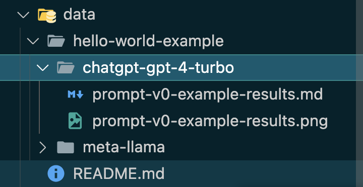
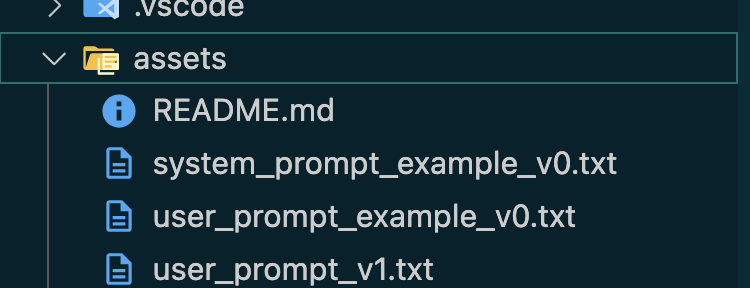
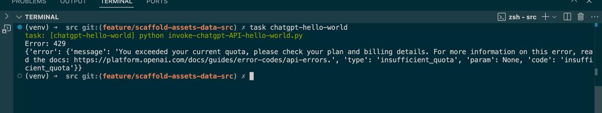
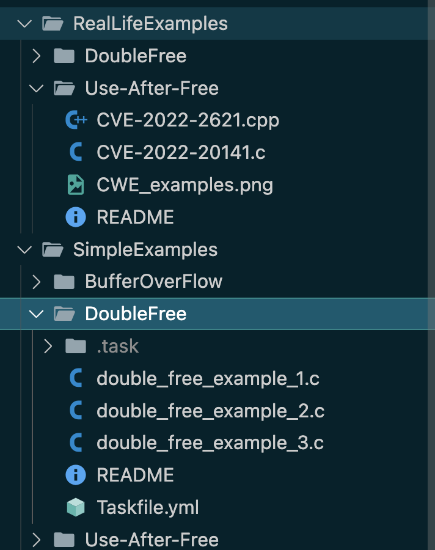

# "Employing LLM-Based Evaluation for Memory Safety Bug Detection and Resolution C"

Check in Report 1: CS487 Final Projet  

Robert D. Hernandez <rherna70@uic.edu>

Dawid Biel <djbiel2@uic.edu>

We have focused on laying the groundwork and organization for a successful project, agreeing on tools, gathering trivial and real-world bug examples, creating git resources, meeting in person, created some source code for invoking APIs interactively, and added some example system and user prompts, and project structure for easy addition of new LLMs and bug types.

Here you can see the main branch with all the code: <https://github.com/Rhernandez513/cs487-proj>

And here you can see the pull request history with changes: <https://github.com/Rhernandez513/cs487-proj/pulls?q=is%3Apr>

V1 System Prompt:

    Evaluate the following code for memory-related errors, focusing on buffer overflows, double free occurrences, and use-after-free vulnerabilities. Identify any areas in the code where memory handling could lead to security vulnerabilities or instability in execution. Provide an analysis that includes specific lines or functions prone to these issues, and suggest corrections if needed to ensure safe memory allocation, access, and deallocation.

We have create a bit of project structure and organization for gathering data:

A big of project structure and organization for sytem and user prompts that will be used as input into the LLMs

Interactive use of a simple code snippet to invoke the OPENAI API using Python:

We have additionally gathered 3x trivial examples of each bug type we intend to test (BufferOverFlow, DoubleFree, Use After Free) and a couple of real life bug examples.

Example bugs:

