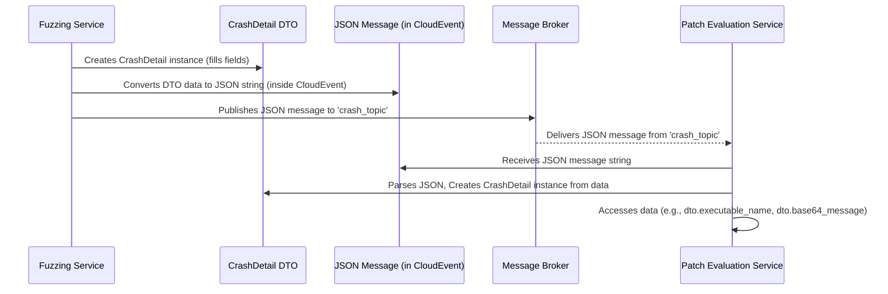

# Section 5: Data Transfer Objects (DTOs) <!-- omit in toc -->
- [Under the Hood: The Flow of Information](#under-the-hood-the-flow-of-information)
- [What Problem Do DTOs Solve?](#what-problem-do-dtos-solve)
- [What are DTOs, Exactly?](#what-are-dtos-exactly)
- [How to create your own DTOs](#how-to-create-your-own-dtos)
- [Building and Installing the module](#building-and-installing-the-module)
- [Using a datatype](#using-a-datatype)
- [Creating new datatypes](#creating-new-datatypes)
- [Key DTOs in AutoPatch](#key-dtos-in-autopatch)
- [How DTOs are Used in AutoPatch](#how-dtos-are-used-in-autopatch)
- [Conclusion](#conclusion)


## Under the Hood: The Flow of Information

Here's a simplified diagram showing how a DTO like `CrashDetail` travels from the Fuzzing Service to the Patch Evaluation Service:



This standardized process ensures reliable communication, even though the services might be running independently.

How do the various AutoPatch services talk to each other? When the Fuzzing Service finds a crash, how does it tell the Patch Evaluation Service exactly *what* crashed and *how*?
When the LLM Service generates a patch, how does it package that patch so the Evaluation Service knows what to test?

This is where **Data Transfer Objects (DTOs)** come in. They are the standardized way we pass information around in AutoPatch.

## What Problem Do DTOs Solve?

In a system like AutoPatch with multiple independent services, we need a standard way to structure the data being passed between them. If the Fuzzing Service just sent a jumble of text about a crash, the Patch Evaluation Service wouldn't know how to interpret it reliably.

**Use Case:** The Fuzzing Service finds a crash in `program.c` caused by the input `"\x41\x41\x41\..."`. It needs to send this information to the Patch Evaluation Service. The Evaluation Service needs to know *precisely*:
1. Which program crashed (`program.c`).
2. What the exact input was (`"\x41\x41\x41\..."`).
3. Was this input originally given as a file or directly?

DTOs solve this by defining a fixed structure, like a pre-printed form or a template, for specific pieces of information. Everyone agrees on the fields and what they mean.

## What are DTOs, Exactly?

A Data Transfer Object (DTO) is a simple object whose main purpose is to hold data and make it easy to transfer between different parts of a system (like different services in AutoPatch).

Think of them as standardized containers or forms:
*   **Standardized:** They have a predefined structure or "shape". Everyone knows exactly what fields (pieces of information) to expect.
*   **Data Holders:** Their job is just to carry data, not to perform complex actions or calculations.
*   **Transfer:** They are designed to be easily converted into formats suitable for sending across networks or between processes (like JSON).

In AutoPatch, DTOs ensure that when one service sends information (like crash details), the receiving service knows exactly how to read and understand that information, preventing errors and misunderstandings.


## How to create your own DTOs

> [!WARNING]  
> If you update a datatype be sure to rebuild and reinstall the module.  As you make improvements update the version according to Semantic Versioning

## Building and Installing the module

First build the package
Navigate to `/workspace/AutoPatch-LLM/src/autopatchdatatypes`

Then run

```sh
python -m build

> [...]
> Successfully built autopatchdatatypes-0.2.0.tar.gz and autopatchdatatypes-0.2.0-py3-none-any.whl
```

Then while still inside the `/workspace/AutoPatch-LLM/src/autopatchdatatypes` directory install the package with:

NOTE: you may need to use the `--break-system-packages` CLI flag if you are running inside the dev container

```sh
pip install .

> [...]
> Successfully installed autopatchdatatypes-0.2.0
```

## Using a datatype

Then feel free to import the package and use the datatypes in your services like so:

```python
import base64
from autopatchdatatypes import CrashDetail

# Encode
crash_detail_string = 'hello world'
encoded_bytes = base64.b64encode(crash_detail_string.encode('utf-8'))
print("Encoded:", encoded_bytes)

>>> Encoded: b'aGVsbG8gd29ybGQ='

# Use datatype
crash_detail = CrashDetail("dummy_executable_name", crash_detail_string, False)

print(type(crash_detail))
print(crash_detail)

>>> <class 'autopatchdatatypes.crash_detail.CrashDetail'>
>>> CrashDetail(executable_name='dummy_executable_name', base64_message=b'aGVsbG8gd29ybGQ=', input_from_file=False)

# Decode
decoded_bytes = base64.b64decode(encoded_bytes)
decoded_string = decoded_bytes.decode('utf-8')
print("Decoded:", decoded_string)

>>> Decoded: hello world
```

## Creating new datatypes

Use the `@dataclass` decorator from the standard library, create new datatypes in their own files at `/workspace/AutoPatch-LLM/src/autopatchdatatypes/autopatchdatatypes/example_datatype.py`


```python
from dataclasses import dataclass


@dataclass
class ExampleDatatype:
    some_value: int
    some_other_value: str
```

## Key DTOs in AutoPatch

AutoPatch uses several DTOs defined in the `autopatchdatatypes` shared library. Let's look at the main ones we've already encountered conceptually:

**1. `CrashDetail`**

* **Purpose:** To carry information about a specific crash found by the [Fuzzing Service](01_fuzzing_service_.md).
* **Used By:** Published by the Fuzzing Service, consumed by the [Patch Evaluation Service](04_patch_evaluation_service_.md).
* **Fields (Shape):**
    * `executable_name` (string): The name of the program that crashed (e.g., `program.afl`).
    * `base64_message` (string): The *exact* input that caused the crash. Because crash inputs can contain strange characters or be binary data, it's encoded using base64 (a standard way to represent any data using safe text characters).
    * `is_input_from_file` (boolean): Was the input originally provided as a file (`True`) or directly to the program's input (`False`)?

```python
from dataclasses import dataclass
import base64 # Used for encoding/decoding

@dataclass
class CrashDetail:
    executable_name: str
    base64_message: str # The crash input, Base64 encoded
    is_input_from_file: bool

    # (It also includes validation to ensure the message is valid Base64)
```
This simple structure ensures the Patch Evaluation Service gets all the necessary details to reproduce the crash.

**2. `CpgScanResult`**

* **Purpose:** To carry information about a potential vulnerability found by the [Code Property Graph (CPG) Generation Service](02_code_property_graph__cpg__generation_service_.md) using `joern-scan`.
* **Used By:** Published by the CPG Service, consumed by the [LLM Dispatch & Patch Generation Service](03_llm_dispatch___patch_generation_service_.md) to provide context to the AI.
* **Fields (Shape):**
    * `executable_name` (string): The name of the C file analyzed (e.g., `vulnerable_program.c`).
    * `vulnerability_severity` (float): A score indicating how severe Joern thinks the issue might be.
    * `vulnerable_line_number` (int): The line number in the code where the issue was detected.
    * `vulnerable_function` (string): The name of the function containing the issue.
    * `vulnerability_description` (string): A short text description of the potential vulnerability (e.g., "Dangerous function gets() used").

```python
from dataclasses import dataclass

@dataclass
class CpgScanResult:
    executable_name: str
    vulnerability_severity: float
    vulnerable_line_number: int
    vulnerable_function: str
    vulnerability_description: str
```
This structure gives the LLM Service specific hints about where and what type of vulnerability might exist.

**3. `PatchResponse`**

* **Purpose:** To carry a suggested code patch generated by an LLM, along with metadata about how it was generated.
* **Used By:** Published by the [LLM Dispatch & Patch Generation Service](03_llm_dispatch___patch_generation_service_.md), consumed by the [Patch Evaluation Service](04_patch_evaluation_service_.md) for testing.
*  **Fields (Shape):**
    * `executable_name` (string): The name of the program this patch is intended for (e.g., `vulnerable_program`).
    * `patch_snippet_base64` (string): The actual suggested code patch (or sometimes the entire patched file content), encoded using base64 for safe transfer.
    * `TransformerMetadata` (another DTO): Contains details about the AI model that generated the patch.
    * `status` (string): Indicates if the patch generation was successful (e.g., "success", "fail").

```python
from dataclasses import dataclass
from autopatchdatatypes.transformer_metadata import TransformerMetadata

@dataclass
class PatchResponse:
    executable_name: str
    patch_snippet_base64: str # Base64 encoded patch code
    TransformerMetadata: TransformerMetadata # Nested DTO
    status: str
```

**3a. `TransformerMetadata`**

* **Purpose:** To provide details about the specific AI model (LLM) used to generate a patch. This is nested inside `PatchResponse`.
* **Fields (Shape):**
    * `llm_name` (string): The name of the base model (e.g., `gpt-4`, `gemini-pro`).
    * `llm_version` (string): The specific version of the model used (if available).
    * `llm_flavor` (string): The provider or type of the model (e.g., `openai`, `google`).
    * *(Other fields related to model configuration might exist)*

```python
from dataclasses import dataclass

@dataclass
class TransformerMetadata:
    llm_name: str
    llm_version: str
    llm_flavor: str
    # ... other potential config details such as temperature or top_p
```

## How DTOs are Used in AutoPatch

1. **Creation:** When a service has information to send (e.g., the Fuzzing Service finds a crash), it creates an instance of the appropriate DTO class, filling in the fields with the relevant data.

2. **Serialization:** To send the DTO over the network (via the [Message Broker Client](06_message_broker_client_.md)), it needs to be converted into a standard text format, usually JSON. Often, this DTO data is wrapped inside a `CloudEvent` structure (another standard for describing events), which is then converted to JSON.

3. **Transmission:** The JSON string (representing the CloudEvent containing the DTO) is sent as a message using the message broker.

4. **Deserialization:** The receiving service gets the JSON message. It parses the JSON string, extracts the data corresponding to the DTO, and creates a new instance of the DTO class using that data.

5. **Usage:** The receiving service can now easily access the structured information from the DTO fields, just like in the creation example (`crash_info.executable_name`, etc.).


## Conclusion

Data Transfer Objects ensure clear and consistent communication between the different services in AutoPatch. By defining a standard "shape" for data like `CrashDetail`, `CpgScanResult`, and `PatchResponse`, ensure the whole system works together seamlessly.

Next we examine *how* these DTOs (packaged as messages) get sent and received between services. That's the job of our next component, message broker and our client for interacting with it.
