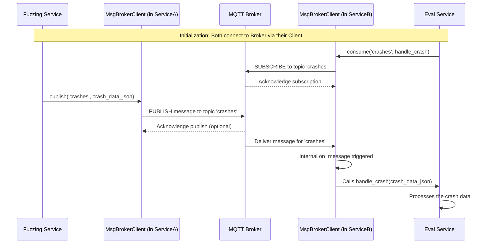

# Section: Message Broker Client <!-- omit in toc -->

- [Under the Hood: Client Internals](#under-the-hood-client-internals)
- [What Problem Does This Client Solve?](#what-problem-does-this-client-solve)
- [Key Concepts](#key-concepts)
- [How the Message Broker Client Works (Usage)](#how-the-message-broker-client-works-usage)
- [Conclusion](#conclusion)

## Under the Hood: Client Internals

How does the `MessageBrokerClient` actually achieve this? It uses a Python library called `paho-mqtt` to handle the details of the MQTT protocol.

**Simplified Flow:**

1. **Connection:** When you create a `MessageBrokerClient`, its `__init__` method uses `paho-mqtt` to establish a network connection to the MQTT broker. It also sets up internal callback functions (`on_connect`, `on_disconnect`, `on_message`, `on_publish`) that `paho-mqtt` will call for different events.
2. **Background Loop:** The client starts a background thread (`client.loop_start()`) that constantly communicates with the broker, handles network activity, processes incoming messages, and manages reconnections if the connection drops.
3. **Publishing:** When you call `message_client.publish(topic, message)`, it essentially hands the topic and message over to the `paho-mqtt` library's `publish` function, which sends it to the broker via the established connection.
4. **Subscribing:** When you call `message_client.consume(topic, callback_function)`, the client tells the `paho-mqtt` library to subscribe to that `topic` on the broker. It also stores your `callback_function` in an internal dictionary, mapping the `topic` to your function.
5. **Receiving:** When the broker sends a message to the client for a topic it's subscribed to, the background loop triggers the internal `on_message` callback. This internal callback looks up the topic in its dictionary, finds *your* registered `callback_function`, and calls it, passing the message payload.

Here's a sequence diagram illustrating the publish and subscribe flow:

## What Problem Does This Client Solve?

In a system with many independent services, having them talk directly to each other creates tight coupling.
If Service A needs to send data directly to Service B, Service A needs to know Service B's network address and port.
What happens if Service B restarts or moves? Service A breaks.
What if we want to add a new Service C that also needs the same data from Service A?
Service A would need to be updated to talk to Service C as well. This gets messy quickly!

**Use Case:** The Fuzzing Service finds a crash and creates a `CrashDetail` DTO.
It needs to announce this crash so that the Patch Evaluation Service can later use it to test patches.
However, the Fuzzing Service shouldn't care *who* receives this information or *when* they receive it.
It just needs to reliably "post" the crash information somewhere central.
Similarly, the Patch Evaluation Service needs to "listen" for these crash announcements without needing to know anything specific about the Fuzzing Service.

The Message Broker Client facilitates this by:
1. Providing a way for services to **publish** (send) messages to named channels (called "topics").
2. Providing a way for services to **subscribe** (listen) to specific topics and receive messages sent to them.

This uses a pattern called **Publish/Subscribe (Pub/Sub)**.

## Key Concepts

1. **Message Broker:** This is the central "mailroom" or "bulletin board" server. It's a separate piece of software running in our system (AutoPatch uses one called **MQTT**, specifically the Mosquitto broker). Its job is to receive messages from publishers and deliver them to interested subscribers. The services themselves don't deliver messages; they just talk to the broker.

2. **Topic:** Think of a topic as a specific channel, category, or mailbox name on the bulletin board. For example, we might have a topic called `"autopatch/crash_details"` for crash information and another called `"autopatch/patch_responses"` for suggested patches. Publishers send messages *to* a specific topic, and subscribers listen *on* specific topics.

3. **Publish:** When a service wants to send information (like a `CrashDetail` DTO, usually converted to a JSON string), it uses the Message Broker Client to "publish" that message to a specific topic (e.g., `"autopatch/crash_details"`). The broker then takes care of it.

4. **Subscribe:** When a service wants to receive information related to a certain category, it uses the Message Broker Client to "subscribe" to the relevant topic (e.g., `"autopatch/crash_details"`). It also tells the client, "When a message arrives on this topic, please call this specific function in my code."

5. **Message:** The actual piece of data being sent. In AutoPatch, this is typically a JSON string representing a CloudEvent, which in turn contains one of our Data Transfer Objects (DTOs).

## How the Message Broker Client Works (Usage)

The `MessageBrokerClient` class (from the `autopatchpubsub` library) is used by all our services that need to communicate. Here's how they use it:

**Step 1: Initialization**

Each service creates an instance of the `MessageBrokerClient`. It needs to know the address (host and port) of the central MQTT message broker. This information usually comes from its configuration.  The client code creates the client object, which immediately tries to establish a connection with the MQTT broker running at the specified address.

**Step 2: Publishing a Message**

When a service (like the Fuzzing Service) has data to send (like a `CrashDetail` DTO serialized into a JSON string `crash_json_string`), it calls the `publish` method.

This tells the client to send the `crash_json_string` to the message broker, specifically targeted at the `"autopatch/crash_details"` topic. The broker will then distribute it to any subscribers of that topic. The `publish` method is asynchronous (`async`) because sending network messages can take time.

**Step 3: Subscribing to a Topic**

When a service (like the Patch Evaluation Service) wants to receive messages from a topic, it calls the `consume` method. It provides the topic name and, crucially, the name of a function within its own code that should be executed whenever a message arrives on that topic (this is called a "callback function").

This code registers the service's interest in the `"autopatch/crash_details"` topic. The `MessageBrokerClient` handles listening in the background. When the broker delivers a message for this topic to the client, the client automatically calls our `handle_incoming_crash_message` function, passing the message content as an argument.

## Conclusion

The `MessageBrokerClient` is the communication backbone of AutoPatch, allowing different services to talk to each other without being directly connected. Using the publish/subscribe pattern with topics via an MQTT broker, it acts like a central mailroom:
* Services `publish` messages (containing DTOs as JSON) to specific topics.
* Services `consume` messages by subscribing to topics and providing callback functions to handle incoming data.

This keeps our services decoupled, making the whole system more flexible and robust.
