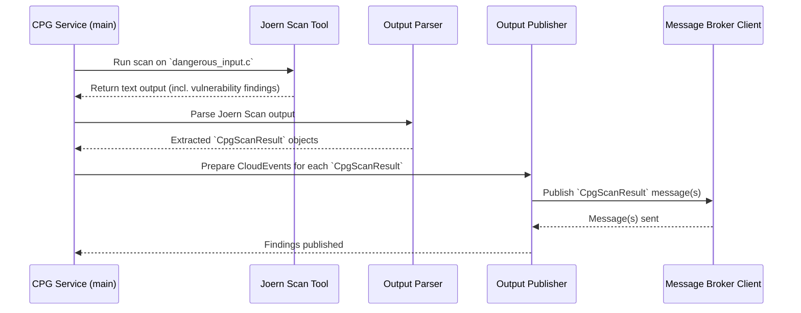

# Section 2: Code Property Graph (CPG) Generation Service <!-- omit in toc -->
- [Under the Hood: Service Flow](#under-the-hood-service-flow)
- [What Problem Does This Service Solve?](#what-problem-does-this-service-solve)
- [Key Concepts: CPGs and Joern](#key-concepts-cpgs-and-joern)
- [How the AutoPatch CPG Service Works](#how-the-autopatch-cpg-service-works)
- [Configuration](#configuration)
- [Conclusion](#conclusion)

## Under the Hood: Service Flow

Here's a diagram showing the main steps when the CPG Service processes a C file:




## What Problem Does This Service Solve?

Simply knowing a program crashes isn't enough to fix it. We need to analyze the source code to understand the underlying vulnerability that caused the crash. Manually reading through code to find subtle security flaws is time-consuming and requires expertise.

**Use Case:** Let's say our Fuzzing Service found that the program `dangerous_input.c` crashes when given a very long string. We suspect a buffer overflow, but where exactly is it in the code? Does the code use a known dangerous function?

The CPG Generation Service helps answer these questions by:
1.  Taking C source code as input.
2.  Using a powerful analysis tool (`joern-scan`) to build a detailed map of the code (the CPG).
3.  Using the same tool to search this map for known patterns of vulnerabilities (like using unsafe functions or potential buffer overflows).
4.  Reporting any potential vulnerabilities found.

## Key Concepts: CPGs and Joern

Before diving into the service, let's understand two key ideas:

1.  **Code Property Graph (CPG):** This is the "detailed map" or "blueprint" we mentioned. It's a way to represent source code as a graph. Think of it like connecting the dots:
    *   **Nodes:** Represent parts of the code like functions (`main`, `get_input`), variables (`buffer`, `user_name`), specific operations (`=`, `+`), method calls (`strcpy`, `gets`), etc.
    *   **Edges (Connections):** Show the relationships between these parts, like "this variable is used in this function," "this function calls that function," "this code runs after that code," or "data flows from this variable to that function."

    By representing code this way, we can ask complex questions about its structure and data flow, which is crucial for finding vulnerabilities.

2.  **Joern (`joern-scan`):** This is the external tool our service uses. It's like a combination architect and building inspector for code:
    *   **Architect:** It reads C source code and automatically builds the complex Code Property Graph (CPG).
    *   **Inspector:** It comes with a set of pre-defined checks (queries) that it runs on the CPG to look for common security vulnerability patterns (like using the dangerous `gets()` function, potential integer overflows, etc.). `joern-scan` is a command-line script that bundles Joern's CPG generation and querying capabilities.

## How the AutoPatch CPG Service Works

The CPG Generation Service takes C source code files and analyzes them using `joern-scan`. It then reports any suspicious findings.

**Input:** The service looks at a specific folder (`cpg_svc_input_codebase_path` in its configuration) containing `.c` source files. Unlike the Fuzzing Service, it currently processes individual `.c` files, not whole projects with Makefiles.

**Step 1: Run Joern Scan on the C File**

For each `.c` file found in the input folder, the service runs the `joern-scan` command-line tool. It tells `joern-scan` which file to analyze.

*   `joern-scan`: The command to execute the tool.
*   `--overwrite`: Tells Joern to create a fresh CPG, even if one exists from a previous run.
*   `c_program_full_path`: The specific C file to analyze.
*   The service runs this command using Python's `subprocess` module and captures its text output (both standard output and error streams).

**Step 2: Parse Joern Scan Output**

`joern-scan` prints its findings to the console in a specific text format. The service needs to read this text and pull out the important details for each vulnerability found.

Joern's output might look something like this (simplified):

```
Result: 8.0 : Dangerous function gets() used : dangerous_input.c : 12 : process_data
Result: 5.0 : Potential buffer overflow : dangerous_input.c : 15 : process_data
```

The service parses each line starting with "Result:"

**Step 3: Package Findings as `CpgScanResult`**

The parsed details for each finding are stored in a `CpgScanResult` object. This is another one of our [Data Transfer Objects (DTOs)](05_data_transfer_objects__dtos_.md), ensuring the information is consistently structured.


**Step 4: Publish the Scan Results**

Finally, the service takes each `CpgScanResult` object and sends it out as a message. Just like the Fuzzing Service, it uses the [Message Broker Client](06_message_broker_client_.md) to publish these findings to a specific topic (`cpg_svc_scan_result_output_topic` from the configuration).

Other services can listen to this topic to get reports about potential vulnerabilities found by static analysis. The messages are again formatted as CloudEvents.

## Configuration

The CPG Generation Service also uses a configuration file (`src/code-property-graph-generator/cpg_svc_config.py`) based on our standard Service Configuration Pattern. This file tells the service:
*   Where to find the `joern-scan` tool (`scan_tool_full_path`).
*   Where the input C files are located (`cpg_svc_input_codebase_path`).
*   How to connect to the message broker (`message_broker_host`, `message_broker_port`).
*   Which topic to publish the results to (`cpg_svc_scan_result_output_topic`).

## Conclusion

CPG Generation Service - our code detective that uses the external tool `joern-scan` to:
1.  Build a detailed map (Code Property Graph) of C source code.
2.  Scan that map for known vulnerability patterns.
3.  Publish any findings as `CpgScanResult` messages.

This service provides crucial information about *potential* weaknesses directly within the source code, complementing the crash information found by the Fuzzing Service.

Given now tht we have crash details (from Fuzzing) and potential static code vulnerabilities (from CPG Scan). How do we combine this information and use a Large Language Model (LLM) to actually *suggest* a fix for the code?  We introduce the LLM Dispatch Service.
