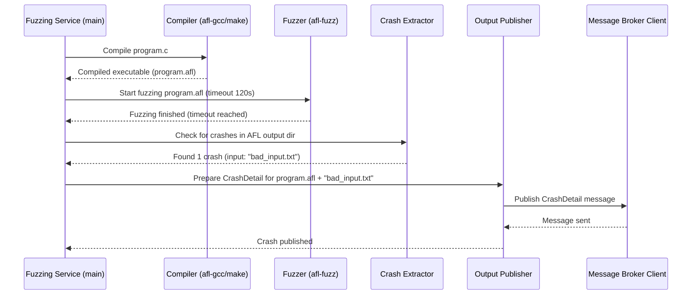

# Section: Fuzzing Service <!-- omit in toc -->

- [Under the Hood: Service Flow](#under-the-hood-service-flow)
- [What Problem Does Fuzzing Solve?](#what-problem-does-fuzzing-solve)
- [How the AutoPatch Fuzzing Service Works](#how-the-autopatch-fuzzing-service-works)
- [How to Use](#how-to-use)
- [Logging config](#logging-config)
- [Configuration](#configuration)
- [Conclusion](#conclusion)

## Under the Hood: Service Flow

Here's a simplified diagram showing the main steps when the Fuzzing Service runs:

## What Problem Does Fuzzing Solve?

Software bugs, especially those causing crashes, can be sneaky. They might only appear under very specific, unusual conditions or with weird input data.

**Use Case:** Given a C that reads some STDIN or text file and processes it. We want to automatically test if *any* kind of text input could make it crash, without having to manually type thousands of strange combinations.

The Fuzzing Service tackles this by automatically:
1. Running the program repeatedly.
2. Feeding it a massive amount of automatically generated, often random or malformed, inputs (this is called "fuzz").
3. Watching closely to see if any input causes a crash.
4. If a crash occurs, carefully recording the *exact* input that caused it.

Our Fuzzing Service uses a popular and powerful fuzzing tool called **AFL (American Fuzzy Lop)++**. AFL is smart about generating inputs; it observes how the program behaves and uses that information to create new inputs that are more likely to explore different parts of the code and find crashes.

## How the AutoPatch Fuzzing Service Works

The Fuzzing Service is the starting point of the AutoPatch pipeline. It takes source code as input and produces details about any crashes it finds. Let's break down its process step-by-step:

**Input:** The service looks at a specific folder (`fuzz_svc_input_codebase_path` in its configuration) containing the C source code projects we want to test. These can be single `.c` files or entire project directories that use a `Makefile` for building.

**Step 1: Compile the Code for Fuzzing**

Before AFL can fuzz a program, the program needs to be compiled with a special compiler (`afl-gcc` or `afl-clang`). This in conjunction with the AddressSanitizer compiler feature code instrumentation that let AFL see which parts of the program are being executed by a given input. This helps AFL generate better fuzz data.

* **Single Files:** If it finds a `.c` file (like `my_program.c`), it compiles it directly.
* **Projects:** If it finds a directory with a `Makefile`, it tries to use the `make` command with the AFL compiler.

This step creates an executable file (like `program.afl`) ready for fuzzing.

**Step 2: Run the Fuzzer (AFL)**

Now the service unleashes AFL on the compiled program. It tells AFL things like:
* Where to find some initial example inputs ("seed inputs").
* Where to save its findings (especially crashes).
* How long to run (`fuzzer_tool_timeout_seconds`).
* How much memory the program is allowed to use.
* *Importantly:* How the program expects input. Does it read from a file? (`isInputFromFile = True`, AFL uses `@@` placeholder). Or does it expect input directly? (`isInputFromFile = False`).

AFL runs for the specified time, trying countless inputs.

**Step 3: Check for Crashes**

Once the fuzzing time is up, AFL will have created an output directory. Inside this directory, AFL saves any input files that caused the program to crash.  Here we use configuration to set the output directory to `/app/data/afl_tool_output`

The Fuzzing Service checks if this `crashes` folder exists and if it contains any files.

**Step 4: Package Crash Details**

For every crash found, the service gathers the important details:
1. The name of the program that crashed (e.g., `program.c`).
2. The input that caused the crash. Since this input might contain weird characters or be binary data, it's encoded using base64 (a way to represent any data using standard text characters).
3. Whether the input was expected as a file path or as direct data (`isInputFromFile`).

This information is put into a structured format called `CrashDetail`. This is one of our Data Transfer Objects (DTOs), designed for passing information between services.

**Step 5: Publish the Crash Report**

Finally, the Fuzzing Service takes each `CrashDetail` object and sends it out as a message. It uses a helper component, the [Message Broker Client](06_message_broker_client_.md), to publish these messages to a specific channel or "topic" (defined in the configuration as `fuzz_svc_output_topic`).

Think of this like mailing a detailed crash report. Other services AutoPatch are listen on this channel, waiting for these reports so they can take the next steps. The messages are formatted as CloudEvents, a standard way to describe events.

The service also saves a record of the crashes found locally in a CSV file for development and debugging logging purposes.

## How to Use

- use config.json when running as a container, like with docker-compose or k8s
- use dev-config.json when running interactively like in a debugger inside a devcontainer, or on your local host system

- Ensure the `FUZZ_SVC_CONFIG` env var is set.  You may remove the "example" suffix from `/src/fuzzing-service/.env.example` remove the "example suffix" and set the appvar contained within `FUZZ_SVC_CONFIG` to point to the above "config.json" and source the file into your environment to use

## Logging config

- if you like, set your logging to be less verbose in logging-config.json

- If you want to collect debut logs edit the logging-config.json file handler to point to a file that exists on host system if running locally, or mount a host volume to /app/logs/ inside the contianer to collect debug logs from /app/logs/debug.log

## Configuration

Like other parts of AutoPatch, the Fuzzing Service relies on configuration files to know where to find tools (like `afl-gcc`, `afl-fuzz`, `make`), where the input code is, where to write output, and how to connect to the message broker. You can see the settings it uses in `src/fuzzing-service/fuzz_svc_config.py`. This follows a common Service Configuration Pattern used throughout the project.

## Conclusion

The fuzzing-service automatically stress-testing programs with AFL to find inputs that cause crashes. It then carefully packages the details of these crashes (the program name and the specific input) into `CrashDetail` messages and publishes them for other services to use.

But finding a crash is just the first step. To fix the bug, we need to understand *why* the crash happened within the code. How can we analyze the source code to pinpoint the vulnerability?  Thus we introduce the Code Property Graph Generator component.
