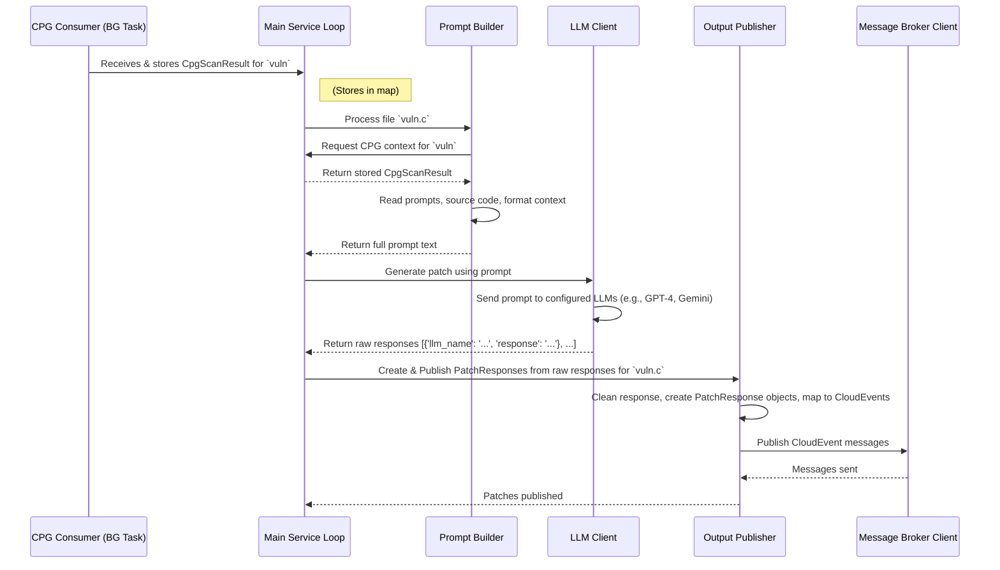

# Section 3: LLM Dispatch & Patch Generation Service <!-- omit in toc -->
- [Under the Hood: Service Flow](#under-the-hood-service-flow)
- [What Problem Does This Service Solve?](#what-problem-does-this-service-solve)
- [Strategy Pattern](#strategy-pattern)
- [Key Concepts: LLMs and Prompts](#key-concepts-llms-and-prompts)
- [How the LLM Dispatch Service Works](#how-the-llm-dispatch-service-works)
- [Configuration](#configuration)
- [Conclusion](#conclusion)

## Under the Hood: Service Flow

Here's a simplified diagram showing the journey for generating a patch for one file, `vuln.c`, assuming CPG context is available:

## What Problem Does This Service Solve?

Now that we know where the bug might exist we need a concrete suggestion on how to change the code to eliminate the vulnerability. Generating correct and safe code patches automatically is a complex task.

**Use Case:** Imagine the CPG Service flagged line 15 in `vulnerable_program.c` because it uses the unsafe `strcpy` function, potentially causing a buffer overflow (which the Fuzzing Service might have confirmed with a crash). We want an AI to look at the code around line 15 and suggest replacing `strcpy` with a safer alternative like `strncpy`, including calculating the correct size limits.

The LLM Dispatch Service acts like a helpful AI programming assistant:
1. It receives the source code (`vulnerable_program.c`).
2. It might also receive context about the vulnerability (like the `CpgScanResult` mentioning `strcpy` on line 15).
3. It asks one or more powerful AI models (LLMs) to suggest a fix.
4. It collects these suggestions and packages them up for the next step in the pipeline.

## Stategy Pattern

BaseLLM: An abstract base class defining the interface for any LLM implementation.

ApiLLM & InMemoryLLM: Two concrete classes simulating an API-based LLM and an in-memory LLM respectively. In a real-world scenario, these would encapsulate the logic for calling an external API or processing locally.

LLMClient: Acts as a facade that registers multiple LLMs and dispatches a prompt to all of them. The generate method collects responses and returns them as a list of dictionaries, each with metadata indicating which LLM produced the response.

This structure makes it easy to extend the system by adding new classes that implement BaseLLM without changing the client code that uses LLMClient.

## Key Concepts: LLMs and Prompts

To understand this service, let's look at two key ideas:

1. **Large Language Model (LLM):** Think of an LLM as a super-advanced autocomplete or chatbot that has been trained on vast amounts of text and code. It's incredibly good at understanding language and generating human-like text, including source code. We can ask it questions or give it instructions, and it will generate a response. Examples include models like GPT-4o, Llama3, Gemini 2.5 Pro, etc.

2. **Prompt:** This is the specific question or instruction we give to the LLM. Getting a good answer from an LLM often depends on asking the right question! For patch generation, a good prompt needs to include:
    * A clear instruction (e.g., "Fix the vulnerability in this C code").
    * Context about the potential vulnerability (e.g., "There might be a buffer overflow on line X related to function Y").
    * The actual source code that needs fixing.

    This service is responsible for carefully crafting these prompts.

3. **Patch:** In software development, a "patch" is a piece of code that corrects a bug or adds a feature. In our context, it's the fixed code snippet suggested by the LLM.

4. **Dispatch & Strategies:** This service can be configured to talk to multiple different LLMs. Why? Because different LLMs might have different strengths or suggest different valid fixes. It's like asking several expert programmers for their opinion. The service "dispatches" the same prompt to these different LLMs (using strategies like calling their APIs) and collects all the responses.

## How the LLM Dispatch Service Works

This service acts as the central coordinator for interacting with LLMs to generate patches.

**Input:**
*  C source code files found in its input directory (`input_codebase_full_path`).
*  Optionally, `CpgScanResult` messages received from the [Message Broker Client](06_message_broker_client_.md) (it listens for these to get context about vulnerabilities found in the code it's about to process).

**Step 1: Listen for CPG Scan Results (Optional Context)**

The service subscribes to the topic where the CPG Service publishes its findings. When it receives a `CpgScanResult` message, it stores it in memory, associating the findings with the specific program name (e.g., `vulnerable_program.c`). This allows it to add vulnerability context to the prompt later.

This runs in the background, continuously collecting context.

**Step 2: Identify and Process Source Code Files**

The service looks for `.c` files in its configured input code directory. For each `.c` file found (e.g., `vulnerable_program.c`), it triggers the patch generation process.

**Step 3: Construct the Full Prompt**

For a specific C file (`vulnerable_program.c`), the service builds the detailed prompt to send to the LLM(s).

* It reads predefined "system" and "user" prompt templates from files. The system prompt might set the overall goal (e.g., "You are a C security expert..."), and the user prompt might give specific instructions ("Find and fix the vulnerability...").
* It reads the actual source code of `vulnerable_program.c`.
* It checks if it has stored `CpgScanResult` context for `vulnerable_program` (from Step 1). If yes, it formats this context into a readable string.
* It combines all these parts: System Prompt + User Prompt + CPG Context (if any) + Source Code.

This creates the detailed request we'll send to the AI.

**Step 4: Initialize and Use the LLM Client**

The service uses an `LLMClient` helper class to manage interactions with different LLMs. This client is configured with the details of the LLMs we want to use (like their names, API endpoints, and necessary API keys loaded from environment variables). It uses a "Strategy" pattern, meaning we can easily switch between different ways of calling LLMs (e.g., calling external APIs vs. using local models).

This step sends our carefully crafted question to the AI assistants.

**Step 5: Process LLM Responses**

The raw responses from the LLMs might contain extra text or be wrapped in formatting like Markdown code blocks. The service extracts just the suggested code patch.

This cleans up the answer from the AI.

**Step 6: Create `PatchResponse` Objects**

For each cleaned-up response from an LLM, the service creates a structured `PatchResponse` object. This is one of our standard Data Transfer Objects (DTOs). It includes:
* The name of the program the patch is for (e.g., `vulnerable_program`).
* The suggested code patch itself (encoded in base64, a way to safely represent any text/code as a standard string).
* Metadata about which LLM generated the patch (name, version, flavor).
* A status (e.g., "success" if code was generated, "fail" if the LLM didn't provide a useful response).

This packages the AI's suggestion into a standard format.

**Step 7: Publish Patch Responses**

Finally, the service takes each `PatchResponse` object and publishes it as a message using the Message Broker Client. These messages are sent to a specific topic (`llm/dispatch/response` as defined in the configuration). Other services, like the Patch Evaluation Service, listen on this topic to receive the suggested patches.

This sends the suggested fixes out for the next stage of processing.

## Configuration

This service relies heavily on its configuration file (`src/llm-dispatch-service/llm_dispatch_svc_config.py`) and environment variables. Key settings include:
* `input_codebase_full_path`: Where to find the C source files.
* `system_prompt_full_path`, `user_prompt_full_path`: Paths to the prompt template files.
* `models`: A list of LLM identifiers to use (e.g., `["openai/gpt-4", "google/gemini-pro"]`).
* `message_broker_host`, `message_broker_port`, `message_broker_topics`: How to connect to the message broker and which topics to use for input (CPG results) and output (patch responses).
* `MODEL_ROUTER_BASE_URL`, `MODEL_ROUTER_API_KEY` (Environment Variables): Crucial details for accessing the LLM APIs (often via a router service like OpenRouter).

This follows the standard Service Configuration Pattern used across AutoPatch.

## Conclusion

You now understand the LLM Dispatch! It's the core AI component that:
1. Combines source code with vulnerability context (if available).
2. Constructs detailed prompts.
3. Dispatches these prompts to one or more configured Large Language Models (LLMs).
4. Processes the LLM responses to extract potential code patches.
5. Publishes these patches as `PatchResponse` messages for further evaluation.

You man consider it as the project manager who takes the bug report (vulnerability info) and the faulty code, asks several expert AI programmers (LLMs) for fixes, and collects their proposed solutions (patches).

But are these suggested patches actually correct? Do they fix the bug without introducing new problems?  To determine this we introduce the Patch Evaluation Service to show how patches are validated.
