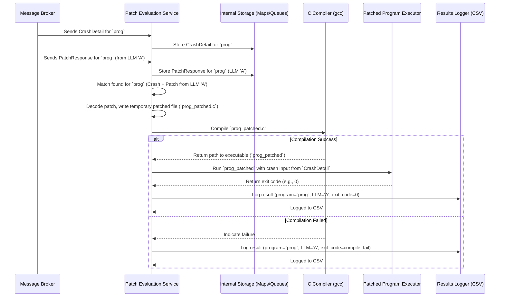

# Section: Patch Evaluation Service <!-- omit in toc -->

- [Under the Hood: Service Flow](#under-the-hood-service-flow)
- [What Problem Does This Service Solve?](#what-problem-does-this-service-solve)
- [How the Patch Evaluation Service Works](#how-the-patch-evaluation-service-works)
- [Configuration](#configuration)
- [Conclusion](#conclusion)

## Under the Hood: Service Flow

Here's a simplified diagram showing the flow when the service evaluates one patch for one crash:

## What Problem Does This Service Solve?

AI models are powerful tools, but they aren't perfect. An LLM might generate a patch that:
* Does not compile (contains syntax errors).
* Compiles, but doesn't actually fix the original crash.
* Fixes the crash, but introduces a *new* bug or unwanted behavior.

We need an automated way to verify if the patch generated by the LLM is actually useful and solves the specific problem (the crash) it was intended to fix.

**Use Case:** Let's say the Fuzzing Service found that `program.c` crashes when given the input `"AAAA..."` (a long string of 'A's). The LLM Dispatch Service generated a patch suggesting using `strncpy` instead of `strcpy`. The Patch Evaluation Service needs to:
1. Take the original `program.c`.
2. Apply the `strncpy` patch suggested by the LLM.
3. Try to compile this new, patched version of `program.c`.
4. If it compiles, run the patched program with the *exact* input `"AAAA..."`.
5. Check if the program still crashes. If it doesn't crash (e.g., it exits normally or prints an error message without crashing), the patch *partially* passed the test for this specific crash input.

This service essentially answers the question: "Did this specific patch fix this specific crash?"

## How the Patch Evaluation Service Works

This service acts like a tester, taking a proposed patch and the original crash details and running the program to see if a crash is triggered.

**Input:**
* **`PatchResponse` Messages:** Received from the LLM Dispatch & Patch Generation Service via the message broker. These contain the suggested code patch (Base64 encoded) and details about the LLM that generated it.
* **`CrashDetail` Messages:** Received from the Fuzzing Service (or potentially other sources) via the message broker. These contain the name of the program that crashed, the specific input that caused the crash (Base64 encoded), and how the input was provided (file or direct).

Let's break down the process step-by-step:

**Step 1: Listen for Crash Details and Patches**

The service constantly listens to two different message channels (topics) using the Message Broker Client:
* One topic for `CrashDetail` messages (`autopatch_crash_detail_input_topic`).
* Another topic for `PatchResponse` messages (`autopatch_patch_response_input_topic`).

When a message arrives, it's put into an internal queue for processing. The service needs to match a `PatchResponse` with the corresponding `CrashDetail` for the *same program*. It uses dictionaries to store these incoming details temporarily, keyed by the program name (e.g., `program.c`).

This step is like collecting bug reports (`CrashDetail`) and proposed solutions (`PatchResponse`) and organizing them by which program they relate to.

**Step 2: Match Inputs and Trigger Evaluation**

A background task (`map_updater`) constantly checks if, for any given program name (e.g., `program.c`), it has received *both* the `CrashDetail` and at least one `PatchResponse`. Once a match is found, it triggers the actual evaluation for that specific Crash/Patch pair.

This acts like a dispatcher, waiting until it has both the problem description and a proposed solution before starting the test.

**Step 3: Compile the Patched Code**

The temporary C file containing the patched code needs to be compiled into an executable program. The service uses a standard C compiler (like GCC, specified in the configuration `compiler_tool_full_path`) for this, unlike the fuzzing service using `afl-gcc` or `afl-clang` we do not need to instrument the code during patch evaluation.

This step checks if the AI's suggested code is even valid C code that can be turned into a runnable program.

**Step 4: Run the Patched Code with Crash Input**

If the patched code compiled successfully, the service now runs the new executable. Importantly, it feeds the executable the *exact same input* that caused the original crash (from the `CrashDetail`).
* It decodes the `base64_message` from the `CrashDetail` back into the raw crash input (bytes).
* If the original crash happened with input from a file (`is_input_from_file` is True), it writes these bytes to a temporary file and passes the file path to the program.
* If the original crash happened with direct input (`is_input_from_file` is False), it pipes the bytes directly to the program's standard input.
* It runs the program asynchronously and waits for it to finish, carefully monitoring its exit code.

This step directly checks if the patch prevented the crash under the original conditions.

**Step 5: Log the Evaluation Result**

Finally, the service records the outcome of the evaluation. It logs key information, typically to a CSV file (`/app/data/<program_name>.csv`):
* Timestamp
* Program name
* The original crash input (Base64)
* The return code from running the patched program (-1 for timeout/error, 0 for clean exit, 1 for gracefully handled exit, other codes for signals/errors)
* Details about the LLM that generated the patch (name, flavor, version)
* The patch itself (Base64)

This step saves the evidence of whether the patch worked or not for later analysis.

## Configuration

Like other services, the Patch Evaluation Service uses a configuration file (`src/patch-evaluation-service/patch_eval_config.py`) managed by the Service Configuration Pattern. Key settings include:
* `input_codebase_full_path`: Where to find the original C source files.
* `patch_eval_results_full_path`: Where to write the output CSV logs.
* `executables_full_path`: Where to put compiled patched executables.
* `compiler_tool_full_path`: Path to the C compiler (e.g., `/usr/bin/gcc`).
* `compiler_warning_flags`, `compiler_feature_flags`: Options for the compiler.
* `compile_timeout`, `run_timeout`: Time limits for compilation and execution.
* `message_broker_host`, `message_broker_port`: Connection details for the message broker.
* `autopatch_patch_response_input_topic`, `autopatch_crash_detail_input_topic`: The specific message topics to listen to.

## Conclusion

The Patch Evaluation Service as an automated QA tester for the patches generated by the LLM. It rigorously checks if a patch:
1. Can be applied and compiled.
2. Prevents the specific crash it was designed to fix when run with the original crashing input.

It logs the results of these tests, providing valuable data on the effectiveness of the AI-generated patches. This feedback is essential for understanding how well the overall AutoPatch system is working.
